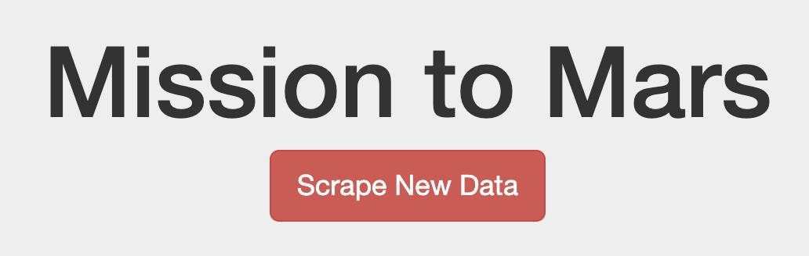
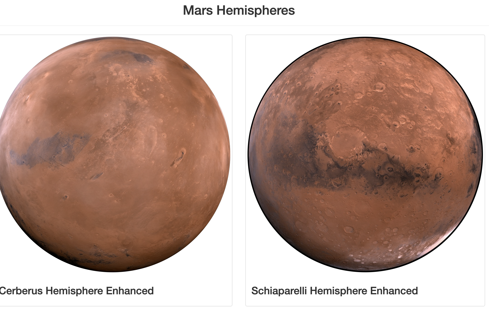

# Mission-to-Mars

## Deliverable 3 Bootstrap Components
- For deliverable 3 of the Mission_To_Mars challenge, these three changes were made to make the webpage more mobile-responsive and stylized. 
  
  1. To make the webpage more mobile responive, I adjusted the columns in for hemispheres in Mars hemispheres div class to equal "col-xs-6" instead of the provided "col-md-6". Doing so would allow the webpage to be mobile responsive and be able to scale to larger size.
  
  2. For one of my stylized changes on the webpage, I used the bootstrap component that allowed for the editing of the color of a button on a webpage. Changing the button classes code from "primary" to "danger", resulted in the color of the "Scrape New Data" button on the webpage to change from being the color blue to the color red. Much more fitting for the red planet. 
  
  
  
  3. Additionally, another stylized change I did for the webpage was using the bootstrap coomponent that allowed for me to alter the image shape of the provided Mars hemispheres on the webpage. Adding class="img-circle" to the Mars Hemisphere images resulted in a more zoomed in, circular image depiction.
  
  
